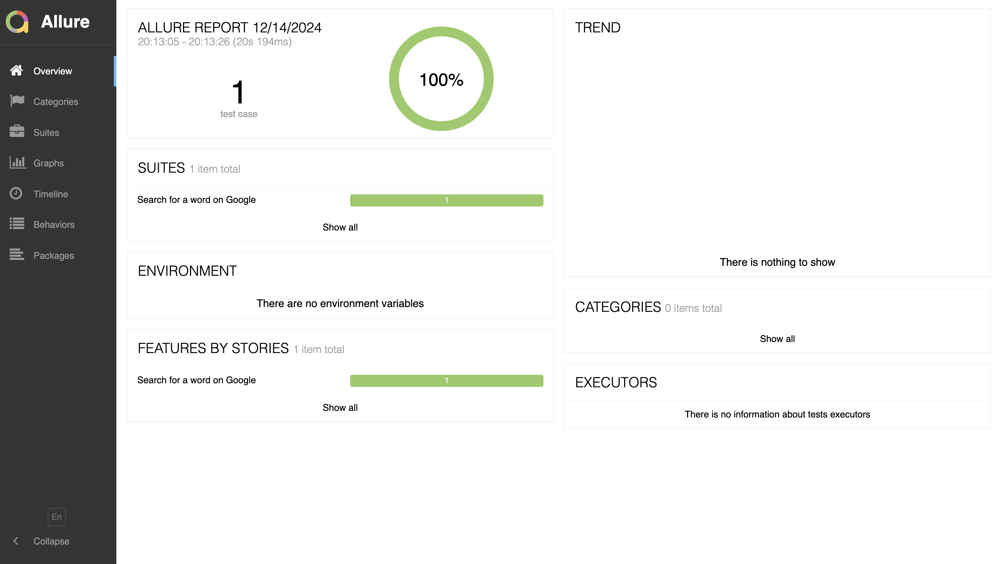
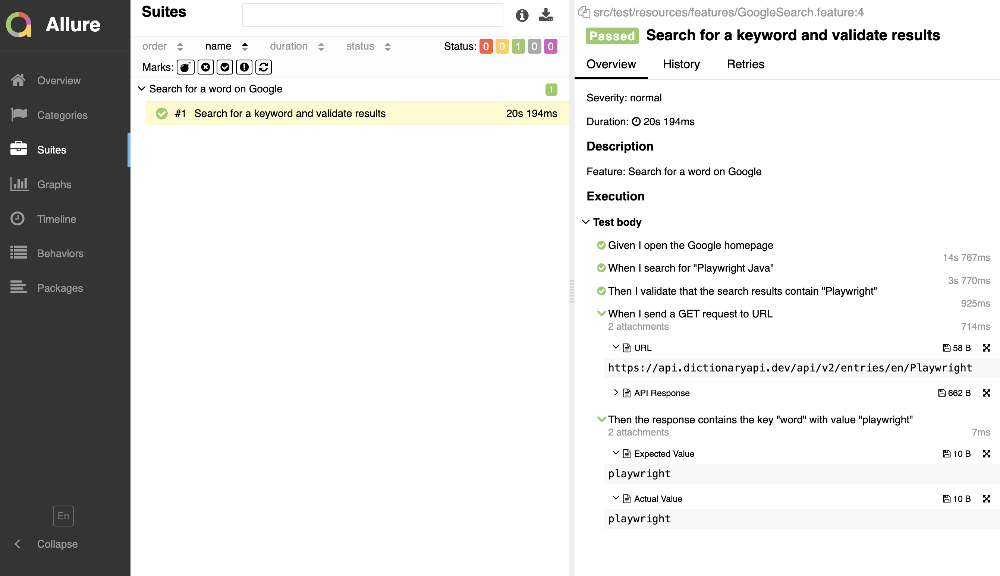

# Playwright Framework with Java, JUnit5, Gradle & Allure Reporting

## Table of Contents

  * [Overview](#overview)
  * [Prerequisites](#prerequisites)
    * [Tools and Versions](#tools-and-versions)
    * [Framework Features](#framework-features)
  * [Setup Instructions](#setup-instructions)
    * [Install Playwright](#install-playwright)
    * [Setup Gradle:](#setup-gradle)
    * [Configure Allure](#configure-allure)
  * [Project Structure](#project-structure)
  * [Gradle Dependencies](#gradle-dependencies)
  * [Allure Reporting](#allure-reporting)
    * [Generate Allure Report](#generate-allure-report)
      * [Generate Report](#generate-report-)
      * [View Report](#view-report-)
      * [IntelliJ IDEA Integration](#intellij-idea-integration)
  * [Running Gradle Commands from Terminal](#running-gradle-commands-from-terminal)
    * [Common Commands](#common-commands)
  * [Notes](#notes)
  * [Screenshots](#screenshots)
    * [Overview](#overview-1)
    * [Features/Suites](#featuressuites)
    * [Graph](#graph)

## Overview
This project is a test automation framework based on the Playwright library. It is implemented using Java, with JUnit5 for test management, Allure for reporting, and Gradle for dependency management and build automation. The framework is compatible with IntelliJ IDEA for development and Git for version control.


## Prerequisites
Ensure you have the following installed:
### Tools and Versions
1. Java Development Kit (JDK): Version 11 or higher.
2. Gradle: Version 7.0 or higher.
3. IntelliJ IDEA: Latest version (Community or Ultimate Edition).
4. Git: Version control system.
5. Node.js: Required for Playwright installation.
6. Allure Commandline: For generating and displaying reports.

### Framework Features
* Playwright: Handles browser automation and interaction.
* JUnit5: Test lifecycle management and assertions.
* Allure Reporting: Generates visual reports for test execution.
* Gradle: Dependency management and build automation.


## Setup Instructions

### Install Playwright:
Run the following command to install Playwright browsers:

`npx playwright install`

### Setup Gradle:
Gradle is configured via `build.gradle` and `settings.gradle`. Follow the dependency section below to ensure everything is configured correctly.

### Configure Allure:
Ensure Allure command-line tools are installed on your machine. You can verify installation with:

`allure --version`

If not installed, you can add Allure using Homebrew (macOS) or Scoop (Windows).

`brew install allure` or `scoop install allure`

## Project Structure

```project-root
Sample Structure

|-- src
|   |-- main
|   |   |-- java (For main framework code, utilities)
|   |-- test
|       |-- java (For test cases)
|-- build.gradle (Gradle dependencies and configuration)
|-- allure-results (Generated Allure report files)
|-- README.md (Project documentation)
```

## Gradle Dependencies

The build.gradle file includes the following key dependencies(sample):
```
plugins {
    id 'java'
    id 'application'
}

dependencies {
    implementation 'com.microsoft.playwright:playwright:1.38.0'
    testImplementation 'org.junit.jupiter:junit-jupiter:5.10.0'
    testImplementation 'io.qameta.allure:allure-junit5:2.22.0'
}

tasks.named('test') {
    useJUnitPlatform()
}
```
## Allure Reporting
* Reports are found in the project under
`build/reports/allure-report`

### Generate Allure Report

#### Generate Report: 
1. Use the following command to generate the Allure report:

   `allure generate --clean allure-results`

#### View Report: 
2. Serve the report locally:

   `allure serve allure-results`

#### IntelliJ IDEA Integration
3. Install the Allure plugin for IntelliJ IDEA for direct report generation and viewing within the IDE.


## Running Gradle Commands from Terminal

### Common Commands

* Build the project:

  `gradle clean build`


* Run the tests using the following command without reporting:

   `./gradlew clean cucumberTest`


* Run the tests using the following command with reporting:

   `./gradlew clean cucumberTest allureReport allureServe`


* Check dependencies:

  `gradle dependencies`


## Notes

* Make sure to use the correct version of Java and Gradle to avoid compatibility issues.

* Regularly update dependencies in build.gradle to ensure compatibility with the latest features and fixes.

* Refer to the official documentation for more details on [Playwright](https://playwright.dev/), [JUnit5](https://junit.org/junit5/docs/current/user-guide/), [Allure](https://allurereport.org/docs/), and [Gradle](https://gradle.org/).

## Screenshots

### [Overview](screenshots/Screenshot 2024-12-14 at 20.17.08.png)


### [Features/Suites](screenshots/Screenshot 2024-12-14 at 20.15.53.png)


### [Graph](screenshots/Screenshot 2024-12-13 at 22.04.36.png)


&copy; 2024 Playwright Web Application Test Automation